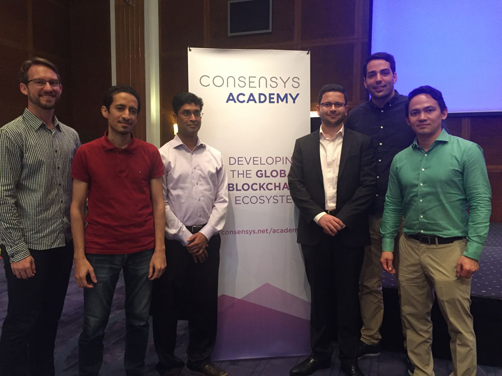
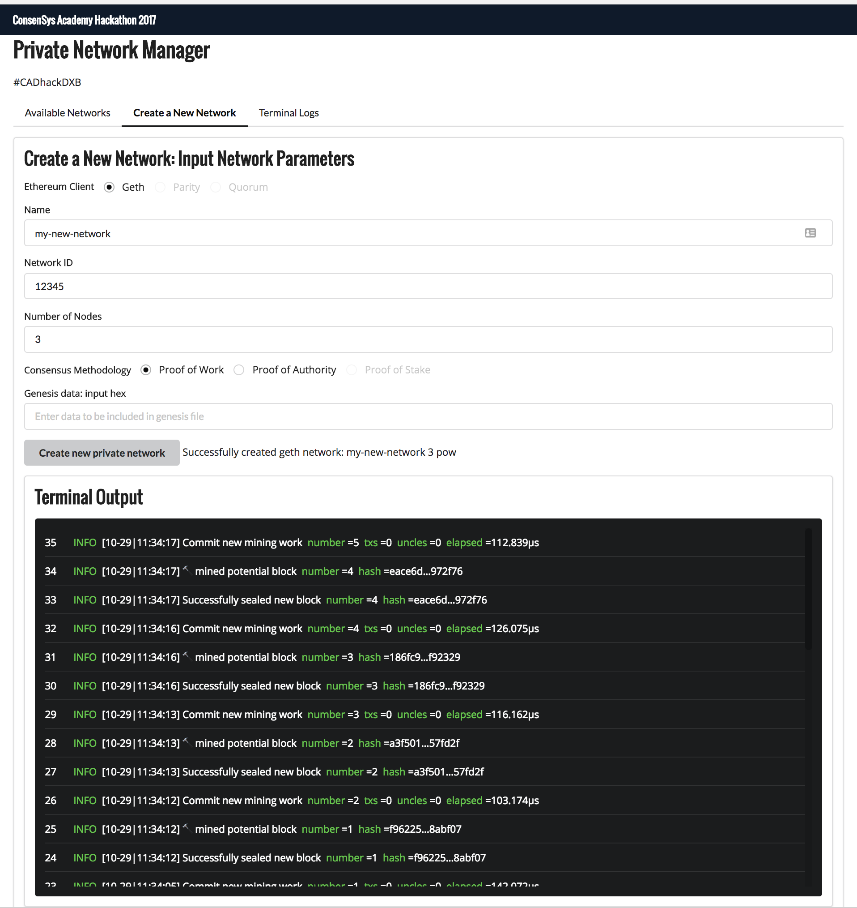
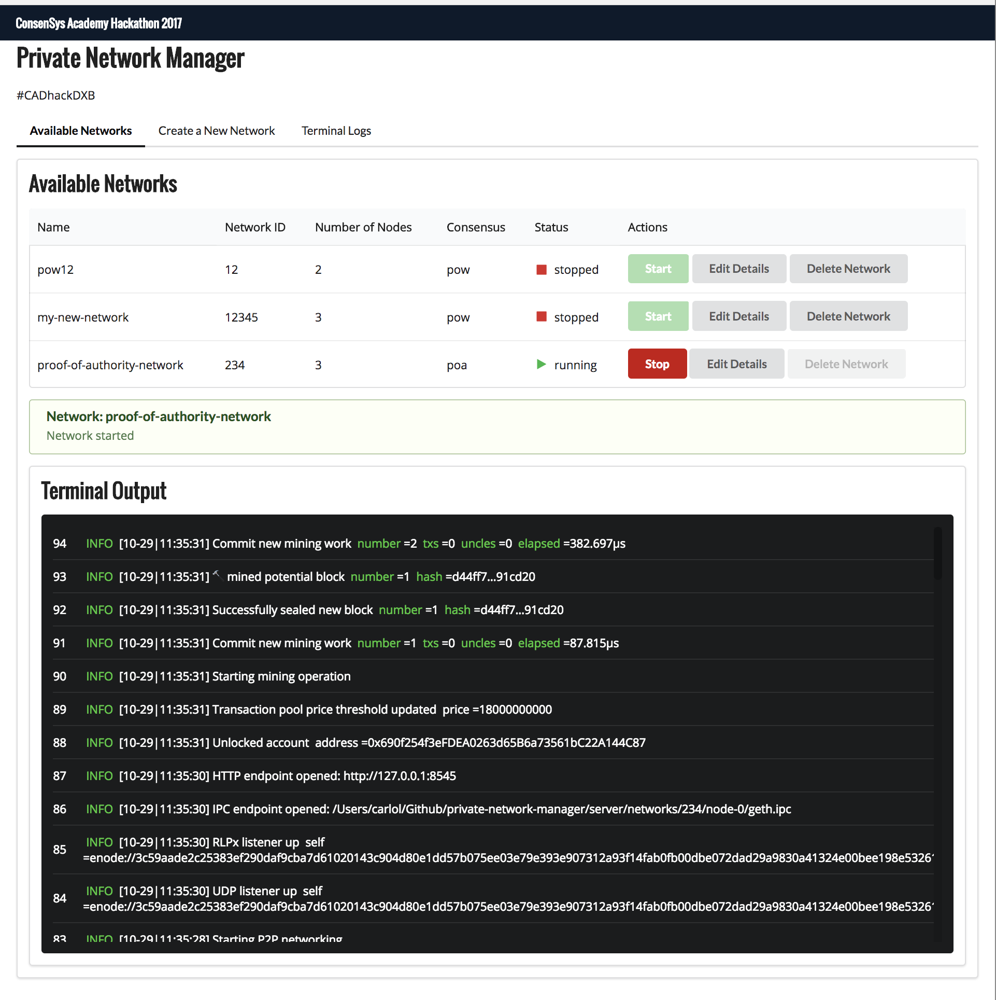

# Project Overview: Blockchain-as-a-Service

Blockchain technology has the potential to revolutionize many organizations, making many processes more efficient, coordinated, and transparent.  However, some of the entities that stand to benefit the most from the efficiencies blockchain technology offers are currently underserved.  In particular, organizations such as governments and enterprises that handle confidential, proprietary, personal, and sensitive information are simply not able to use public blockchains.

Such organizations need private blockchains.  However, the setup and operation of private blockchains is technologically challenging and complex, with limited expertise in this field.  This is a blocker that prevents the potential application and adoption of blockchains.

The vision of Blockchain-as-a-Service is to create a service that allows users to create customized, feature-rich blockchains, even more easily than it would take for them to spin up a new server on Amazon Web Services.  In doing so, organizations would be free to operate their organizations, developers would be able to build new applicationss on top of the blockchain, all without having to worry about the infrastructure layer.

## ConsenSys Academy Developer Program Hackathon

19-22 October 2017

[ConsenSys Academy: Graduation in Dubai](https://media.consensys.net/the-2017-blockchain-developer-course-graduates-in-dubai-4ad4cb315cd2)

This project was undertaken at the ConsenSys Academy Developer Program hackathon, the final stage of program and part of the graduation of the first ever class of blockchain developers.

We are all very proud and honored to have been selected as the overall winner of the hackathon.



### Team Members

**ConsenSys Mentor**
- [Mostafa Farghaly](https://www.linkedin.com/in/mostafafarghaly/) | [@mFarghaly](https://github.com/mFarghaly)

**ConsenSys Academy Developer Team**
- [Ibrahim Abu Ghosh](https://www.linkedin.com/in/ibrahim-abu-ghosh-b4878235/) | [@iabughosh](https://github.com/iabughosh) | Smart Gov Dubai
- [Carlo P. Las Marias]() | [@carlolm](https://github.com/carlolm)
- [Louis Lonjon]() | [@loul42](https://github.com/loul42)
- [Madhan Ramalingam]() | [@madhancr](https://github.com/madhancr)
- [Chris Smith]() | [@iamchrissmith](https://github.com/iamchrissmith)

# Screen Shots






## Installation

1. Install dependencies.
    ```javascript
    npm install
    ```

2. Build files.
    ```javascript
    npm run build
    ```

3. Run server.
    ```javascript
    npm run start
    ```

4. Open in browser @ http://localhost:5000